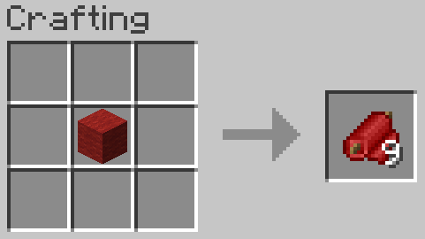

# Fabric for Fabric!

This mod adds fabric to Fabric. One wool block makes 9 pieces of fabric, and 9 pieces of fabric make one wool block.
One piece of fabric with one piece of bonemeal makes a piece of faux leather, which in turn can be converted to leather. Enjoy!

# Recipes 
## Fabric

# Dependencies
Requires 1.16.1 and the Fabric Mod Loader.     

# Credits
Thanks to everyone who helped me on the Fabric Discord server, and to /u/MCThe_Paragon for the textures!
